# 🚀 Gen-AI Powered Integrated Platform Support  Application

## 📌 Table of Contents
- [Introduction](#introduction)
- [Demo](#demo)
- [Inspiration](#inspiration)
- [What It Does](#what-it-does)
- [How We Built It](#how-we-built-it)
- [Challenges We Faced](#challenges-we-faced)
- [How to Run](#how-to-run)
- [Tech Stack](#tech-stack)
- [Team](#team)

---

## 🎯 Introduction
The Integrated Platform Environment (IPE) is a GenAI-enabled console designed to empower platform support teams with intelligent automation, contextual insights, and seamless incident resolution capabilities. It serves as a one-stop environment for identifying, troubleshooting, and resolving platform incidents efficiently.

Key Features:
- Agentic Capabilities for Incident Resolution – Run automations, generate RCA summaries, perform health checks, and fetch related incidents directly from the IPE console.
- AI Chatbot for Contextual Assistance – Engage with a GPT-powered assistant to discuss and resolve incidents in real time.
- Contextual Recommendations – Get insights based on related incidents to assist in resolution.
- Enterprise Data Integration – Leverage MCP-based integrations to access enterprise-wide information for in-depth troubleshooting.

🚀 Coming Soon: Context-based data extraction for connectivity, dependencies, and more!

## 🎥 Demo

📹 [Presentation + Video Demo](artifacts/demo/hackathon%20demo%20video.mp4) |   [Google Drive Link](https://drive.google.com/file/d/1SWObk1NMxSSSuhvrcGHs9jWRQoL8HbLa/view?usp=drive_link)  

[](https://github.com/ewfx/gaipl-gpt-seek/blob/main/code/src/hackathon-video-prototype-demo-only.mp4)

🖼️ Screenshots:

### Incident Management View
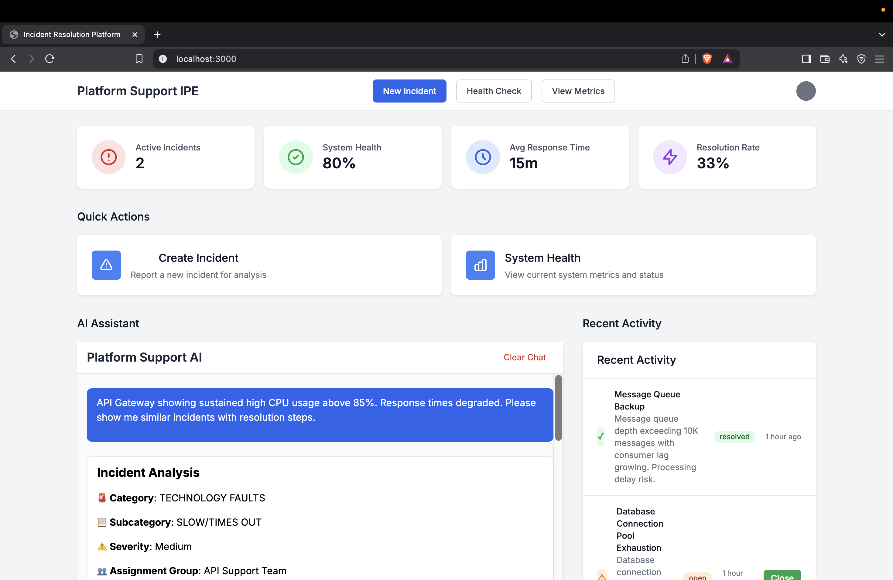
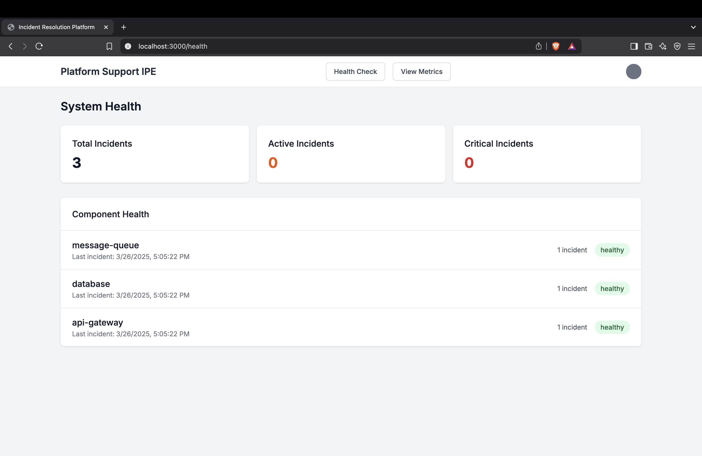 
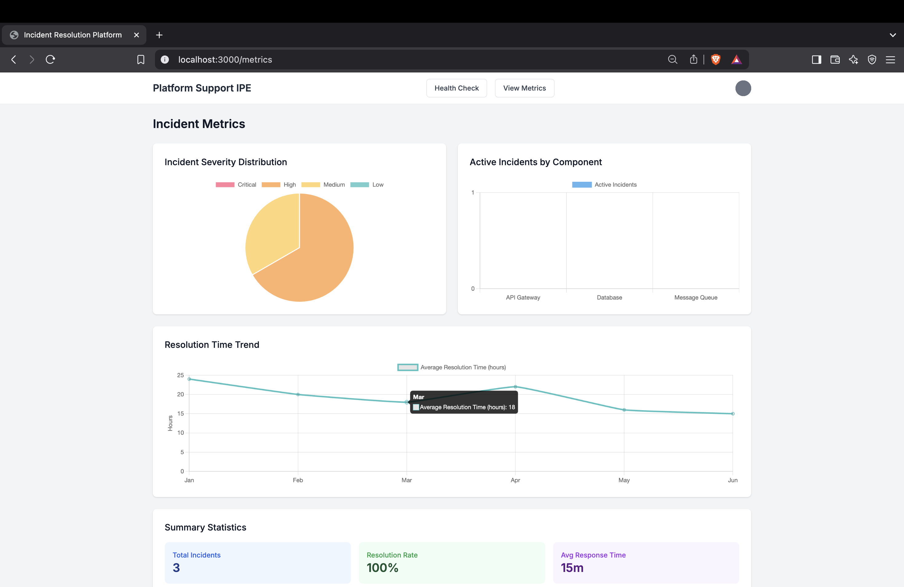

### Chat Interface
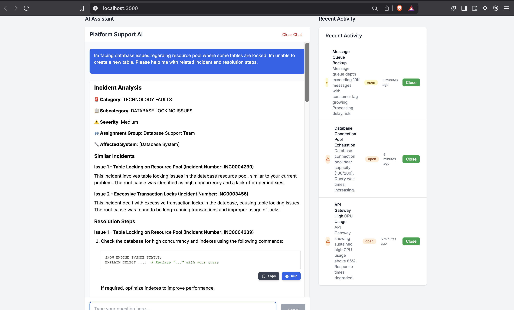
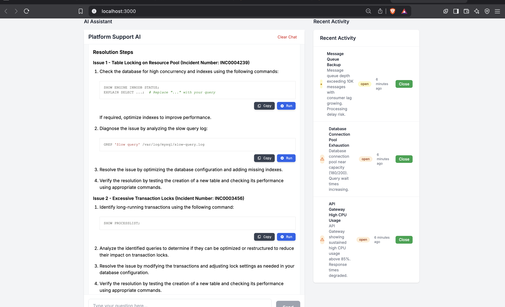

#### Model Coontext Protocol followup
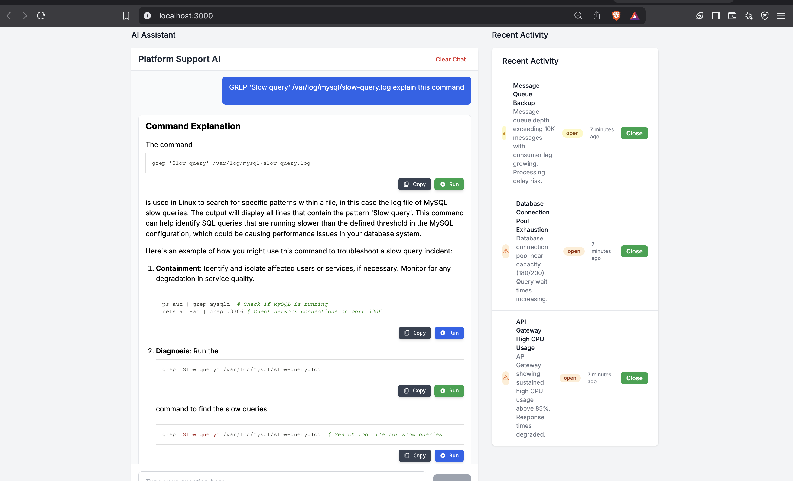

#### Troubleshoot errors
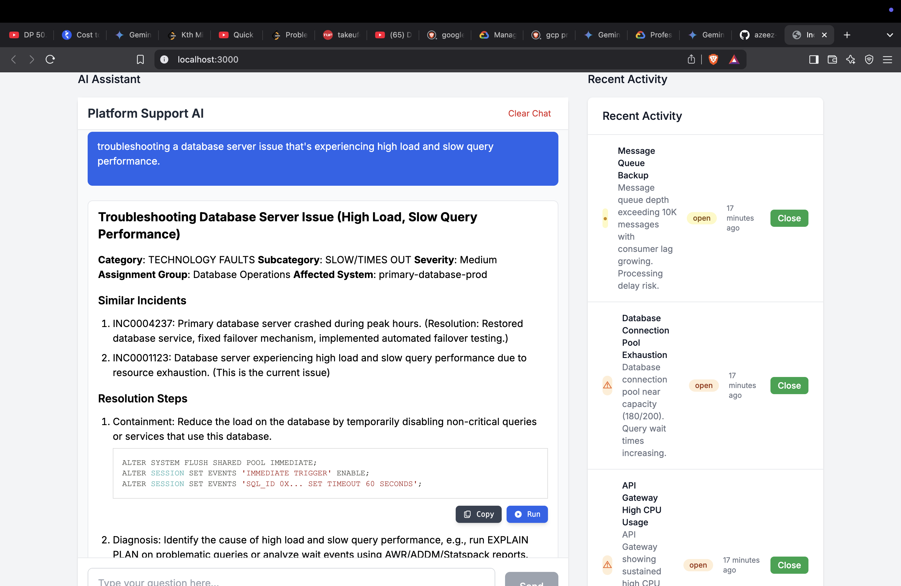
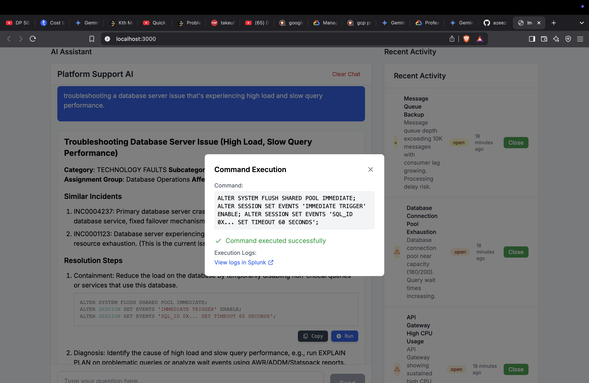


### Agentic AI capabilities
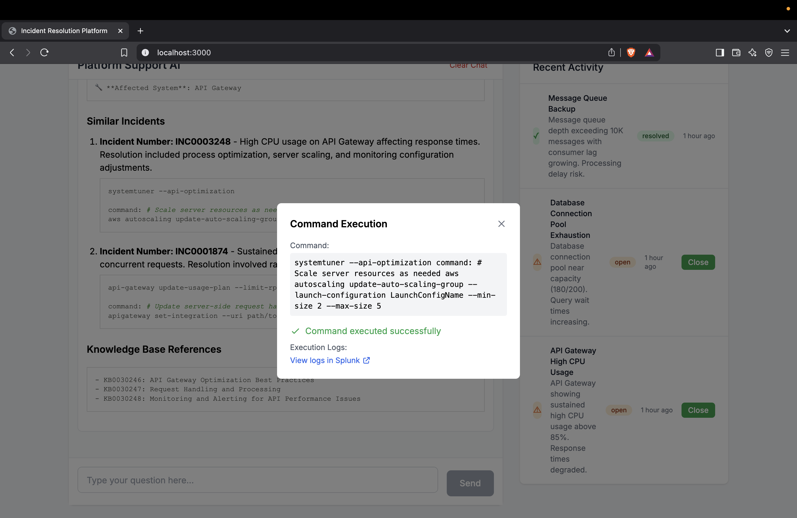
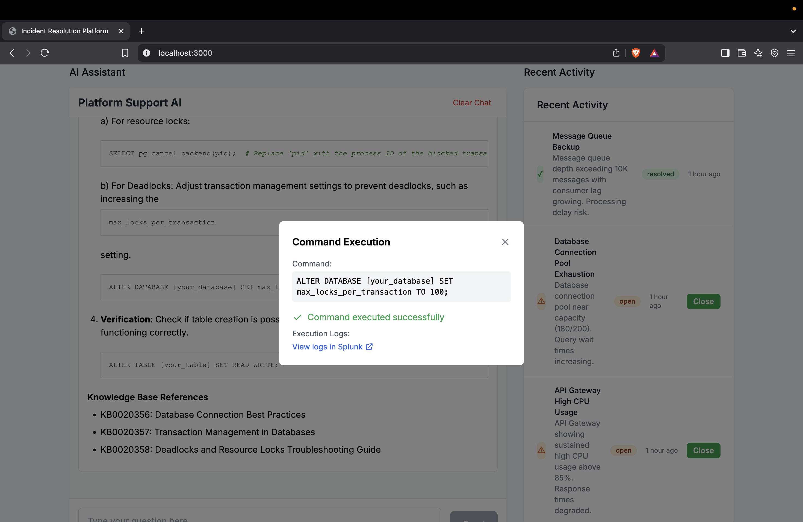
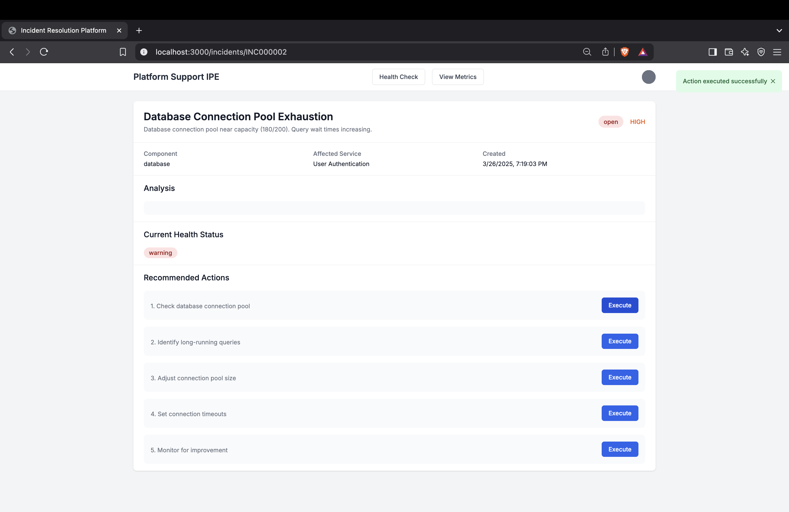

## 💡 Inspiration
The need for a more efficient way to handle platform support incidents by leveraging AI ande limiting contextual switching between different platforms along with providing quick, accurate responses and automated actions. This system combines the power of RAG with a user-friendly interface to streamline incident resolution.

## ⚙️ What It Does
- **Incident Management**: Track and manage incidents
- **AI-Powered Analysis**: Get instant analysis of incidents with recommended actions
- **Interactive Chat AI Assistance**: Get Detailed knowledge on issues using our Ollama-RAG powered chat interface and relevant Knowledge Base articles.
- **Health Monitoring**: Track component health and performance metrics
- **Action Execution**: Execute recommended actions directly from the interface
- **Historical Data**: View similar past incidents and their resolutions

## 🛠️ How We Built It
The system is built using a modern tech stack with a focus on AI/ML capabilities:

1. **Backend Development**:
   - FastAPI for the REST API
   - Ollama for LLM integration
   - Redis for caching context
   - Mistra 7B as LLM
   - FAISS for vector storage

2. **Frontend Development**:
   - Next.js 
   - React for UI components
   - Tailwind CSS for styling
   - TypeScript 

3. **AI/ML Integration**:
   - RAG implementation for context-aware responses
   - Model context Protocol
   - Vector embeddings for semantic search
   - Custom incident analysis models

## 🚧 Challenges We Faced
1. The challenges we faced was to create the right dataset with right parameters for our incidents that could be fed to the LLM for RAG implementation.
2. Identifying the code blocks within the AI- assistant chat output and integrating agentic AI capabilities to run those commands.
3. Classifying incidents across various components and building dashboards to represent them.

## 🏃 How to Run

### Prerequisites
- Python 3.8+
- Node.js 18.x or later
- Ollama installed locally (with a compatible model like mistral or llama2)
- Git

### Setup Steps
1. Clone the repository:
```bash
git clone <repository-url>
cd gaipl-gpt-seek
```

2. Setup backend and create a virtual environment and activate it:
```bash
cd gaipl-gpt-seek/code/src/
python -m venv venv
source venv/bin/activate  # On Windows, use `venv\Scripts\activate`
```

3. Install dependencies:
```bash
cd backend
pip install -r requirements.txt
```

4. Set up the frontend:
```bash
cd gaipl-gpt-seek/code/src/frontend/
npm install
```

5. Make sure Ollama is running with your preferred model:
```bash
ollama pull mistral
ollama serve  # or your preferred model
```

6. **Redis Installation**:
```bash
# For macOS
brew install redis

# For Ubuntu/Debian
sudo apt-get update
sudo apt-get install redis-server
```

7. **Start Redis Server**:
```bash
# Start Redis server
redis-server
```


8. Generate incident dataset:
```bash
# Generate sample incident documents for RAG
python code/src/backend/incident_data/generate_incident_dataset.py
```

9. Initialize the vector store with contextual incident dataset created aboce:
```bash
cd code/src/backend/
python init_vectorstore.py
```

### Running the Application

1. Start the FastAPI backend:
```bash
cd code/src/
uvicorn backend.api.main:app --reload
```


2. Start the frontend development server:
```bash
cd code/src/frontend/
npm run dev
```

3. Open your browser and navigate to `http://localhost:3000`

## 🏗️ Tech Stack
- 🔹 Frontend: Next.js, React, TypeScript, Tailwind CSS
- 🔹 Backend: FastAPI, Python
- 🔹 Vector Store: FAISS for semantic search
- 🔹 AI/ML: Ollama (Mistral) with RAG implementation

## 👥 Team
- **Azeez Dandawala** - [GitHub](https://github.com/azeez-72) | [LinkedIn](https://www.linkedin.com/in/azeez-dandawala/)
- **Abhishek Dharmadhikari** - [GitHub](https://github.com/abhi25072002) | [LinkedIn](https://www.linkedin.com/in/abhishek-dharmadhikari-054682218/)
- **Abisinan A.** - [GitHub](https://github.com/abisinan) | [LinkedIn](https://www.linkedin.com/in/abisinan-a-54bb332b/)

## Project Structure

```
gaipl-gpt-seek/
├── code/
│   └── src/
│       ├── backend/        # FastAPI backend
│       │   ├── api/
│       │   ├── embeddings/
│       │   ├── rag/
│       │   ├── utils/
│       │   └── requirements.txt
│       └── frontend/       # Next.js frontend
|            ├── components/
|            ├── pages/
|            └── package.json
```

## Usage

### Incident Management

- View active incidents
- Update incident status
- Track resolution progress
- Run health checks
- Execute recommended actions

### Chat Interface

- Type your questions in the chat input
- Press Enter or click Send to submit
- Clear chat history using the "Clear Chat" button
- View source documents for AI responses
- Execute commands directly from the chat interface

## API Endpoints

### Core RAG Endpoints

- `POST /query`: Submit a query to get incident response steps
- `POST /documents`: Add new documents to the knowledge base
- `GET /health`: Check system health

### Incident Management Endpoints

- `POST /incidents/` - Create a new incident
- `GET /incidents/` - List all incidents
- `GET /incidents/{incident_id}` - Get incident details
- `POST /incidents/{incident_id}/analyze` - Analyze an incident
- `POST /incidents/{incident_id}/health-check` - Run health check
- `POST /incidents/{incident_id}/execute-action` - Execute an action
- `POST /incidents/{incident_id}/close` - Close an incident

## Development

### Adding New Features

1. Backend changes:
   - Add new routes in `src/api/incident_routes.py`

2. Frontend changes:
   - Add new components in `ui/components/`
   - Update pages in `ui/app/`
   - Add new API calls in `ui/lib/api.ts`
